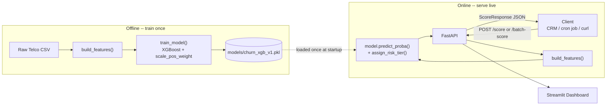

# Churn Risk API

An XGBoost churn-risk model, trained and evaluated end to end, served behind
a FastAPI REST API with request-level and batch scoring, wired to a rules
layer that turns a probability into a retention action, and fronted by a
Streamlit dashboard.

## Problem statement

Telecom subscription revenue depends on retention: acquiring a new customer
costs far more than keeping an existing one. This project scores every
customer's probability of churning in the next billing cycle from their
current account/billing attributes (contract type, tenure, payment method,
services subscribed, monthly/total charges), buckets that probability into
a risk tier, and maps each tier to a specific retention action - so a
retention team (or an automated campaign) can prioritize outreach by risk
instead of guessing, or contacting everyone.

## Architecture



`build_features()` is the same function in both halves — one feature
pipeline, never two, so training and serving can't silently drift apart
(see [Known limitations](#known-limitations--honest-notes)).

### Project structure

```
app/
  core/
    config.py       # all thresholds/paths, loaded from .env — never hardcoded in logic
    logger.py        # structured JSON logging
  schemas/
    score.py         # Pydantic request/response models
  services/
    feature_pipeline.py   # build_features(): raw CSV -> model-ready DataFrame
    model.py               # train/evaluate/persist/align/assign_risk_tier + model singleton
    scoring.py              # score_customer(), score_all_customers()
  main.py            # FastAPI app: /health, /score, /batch-score
notebooks/           # 01-05: EDA -> feature engineering -> training -> scoring, in order
scripts/
  train_model.py     # reproduces models/churn_xgb_v1.pkl from scratch
notes/               # Day 7 manual API test log, kept as a future regression set
streamlit_app.py     # dashboard: hits the live API via requests.post()
```

## Setup

```bash
git clone <this-repo-url>
cd churn_risk_api

python -m venv venv
venv\Scripts\activate        # Windows; use `source venv/bin/activate` on macOS/Linux

pip install -r requirements.txt

cp .env.example .env         # defaults work as-is; edit if you want different thresholds

python scripts/train_model.py   # trains and saves models/churn_xgb_v1.pkl (not committed to git)

uvicorn app.main:app --reload   # API on http://localhost:8000, docs at /docs
```

In a second terminal, with the same venv active:

```bash
streamlit run streamlit_app.py  # dashboard on http://localhost:8501
```

## API examples

**Single customer** — `POST /score`:

```bash
curl -X POST http://localhost:8000/score \
  -H "Content-Type: application/json" \
  -d '{
    "customer_id": "7590-VHVEG",
    "features": {
      "gender": "Female", "SeniorCitizen": 0, "Partner": "Yes", "Dependents": "No",
      "tenure": 1, "PhoneService": "No", "MultipleLines": "No phone service",
      "InternetService": "DSL", "OnlineSecurity": "No", "OnlineBackup": "Yes",
      "DeviceProtection": "No", "TechSupport": "No", "StreamingTV": "No",
      "StreamingMovies": "No", "Contract": "Month-to-month", "PaperlessBilling": "Yes",
      "PaymentMethod": "Electronic check", "MonthlyCharges": 29.85, "TotalCharges": 29.85
    }
  }'
```

```json
{"customer_id":"7590-VHVEG","churn_probability":0.2232,"risk_tier":"low"}
```

**Batch** — `POST /batch-score` (capped at `MAX_BATCH_SIZE`, 500 by default; page across multiple calls for a full daily run):

```bash
curl -X POST http://localhost:8000/batch-score \
  -H "Content-Type: application/json" \
  -d '{"customer_ids": ["7590-VHVEG", "5575-GNVDE", "3668-QPYBK"]}'
```

```json
[
  {"customer_id":"7590-VHVEG","churn_probability":0.2232,"risk_tier":"low"},
  {"customer_id":"5575-GNVDE","churn_probability":0.0459,"risk_tier":"low"},
  {"customer_id":"3668-QPYBK","churn_probability":0.7551,"risk_tier":"high"}
]
```

Both examples above are real output from this API, not illustrative
placeholders. Full interactive docs (request/response schemas, try-it-out)
are auto-generated at `/docs`.

## Model

- **Dataset**: [Kaggle Telco Customer Churn](https://www.kaggle.com/datasets/blastchar/telco-customer-churn) (IBM sample), 7,043 customers, 21 columns.
- **Churn rate**: 26.5% — imbalanced enough that accuracy alone is misleading (a model predicting "no churn" for everyone scores ~73.5%).
- **Features**: 20, after engineering - `contract_risk` (ordinal), `num_services`, `charge_trend`, `is_electronic_check`, `tenure`, plus one-hot encoded categoricals. See `notebooks/02_feature_engineering.ipynb` for the full reasoning per feature.
- **Model**: `XGBClassifier`, `scale_pos_weight=2.769` - compared directly against an unweighted baseline and SMOTE oversampling (`notebooks/03_train_model.ipynb`); `scale_pos_weight` won on both recall and PR-AUC.
- **Metrics** (held-out 20% test split, `random_state=42`):

  | Threshold | Precision | Recall | PR-AUC | ROC-AUC |
  |---|---|---|---|---|
  | 0.5 (default) | 0.540 | 0.671 | 0.617 | 0.821 |
  | 0.780 (deployed - top ~15% riskiest) | 0.693 | 0.393 | 0.617 | 0.821 |

  PR-AUC, not ROC-AUC, is the metric that matters here - ROC-AUC's false-positive-rate denominator is dominated by the large true-negative pool in a 74/26 split, which flatters it. The deployed 0.780 threshold was chosen to fit a retention-campaign budget (contact the riskiest ~15%), not picked by default.

- **Top features by importance**: `contract_risk` (0.372), `InternetService_Fiber optic` (0.320), `InternetService_No` (0.071), `tenure` (0.022), `is_electronic_check` (0.021). `contract_risk` dominating matches the raw EDA correlation; `InternetService_Fiber optic` being nearly as strong was **not** predicted by EDA correlation alone (it ranked well behind `tenure` there) — a real difference between what a linear correlation surfaces and what a tree model can extract.

## Business impact

**What's actually built and measured in this repo:**
- A batch-scoring endpoint that processed 300 real customers in 0.076s locally (~3,900 customers/sec) - see `notes/day7_manual_testing.md` for the full test log, including a run at 100 customers with zero NaNs and correctly-behaving tier boundaries.
- A risk-tiering + retention-action rules layer (`notebooks/04_scoring_pipeline.ipynb`) mapping churn probability to a specific action - proactive discount/contract-upgrade offer, in-app/SMS prompt, or escalation to a human for an atypical high-risk-despite-long-contract case - the same score-feeds-a-rules-layer pattern production retention systems (Duolingo's streak-save nudges, for example) use.
- Structured JSON logging of every scoring request and, per batch, the full score distribution (mean/median/min/max, tier counts) - the mechanism that would catch model drift in production, not just a design intention.

**What I will not claim**: a specific retention-lift number (e.g., "improved 30-day retention by 14%") without an actual production A/B test — there is no live deployment, no real CRM integration, and no control group here, so any such figure would be invented, not measured. 

## Known limitations & honest notes
- **No authentication on the API.** `/score` and `/batch-score` are open - fine for local development, not for anything internet-facing.
- **No CI/CD, no scheduled retraining.** `scripts/train_model.py` must be run manually; nothing currently detects when the model should be retrained versus when a live score jumps because something's actually wrong (see the score-distribution logging in `app/main.py`, which is the raw material a real drift-monitoring system would consume, not the system itself).

## Future work

- **[Evaluation] Model explainability (SHAP).**
- **[Model Ops] Hyperparameter tuning (Optuna).** 
- **[Retention Ops] CRM / webhook integration.** 
- **[Scheduling] Daily batch scoring job.** 
- **[Monitoring] Score drift monitoring.** 
- **[Retention Ops] A/B test the retention offer.**
- **[Retraining] Automated retraining pipeline.**
- **[Deployment] Dockerize the app.**
- **[Deployment] Deploy to Render or Railway.** 
- **[Observability] Experiment tracking (MLflow).** .
- **[Performance] Async batch scoring at scale.**
- **[Safety] Guardrails & fairness checks.** 
